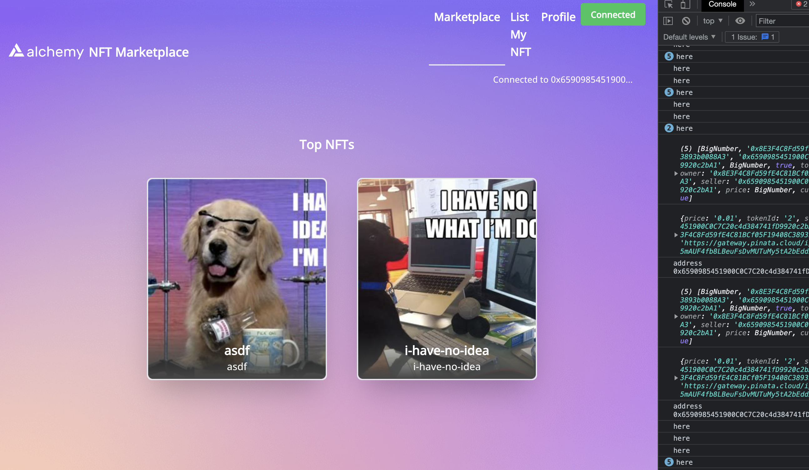

# road_to_web3_week7

### How to create an NFT Marketplace

This week We're going to deep dive into NFTs marketplaces like OpenSea and Rarible, and learn how to build our own! We're going to learn:

- [x] How to create an NFT Marketplace smart contract to list, sell, and buy NFTs
- [x] How to create the front-end of your Marketplace
- [x] Get fees and commissions on NFTs sales

Here we go: - Find the video to the 7th lesson here (https://www.youtube.com/watch?v=y6JfVdcJh1k) - Remember to subscribe to the YouTube channel to not lose any new alpha! - If you prefer the written version
- find the blog version here (https://docs.alchemy.com/docs/how-to-build-an-nft-marketplace-from-scratch)




### NOTES

Deployed contract to Georli:

`0x22EE2A922d70c45dE8de9145176Ca212fBBb18f5`

https://goerli.etherscan.io/address/0x22EE2A922d70c45dE8de9145176Ca212fBBb18f5


ran verify on contract [success]:

`npx hardhat verify --network goerli 0x22EE2A922d70c45dE8de9145176Ca212fBBb18f5`

### Frontend fixs

The tutorial does not work by just copy/paste.


*Here are my fixes:*


Add the following state variable to `src/components/Marketplace.js`

```
const [dataFetched, updateFetched] = useState(false);
```

Add the following state variable to `src/components/NFTpage.js`

```
const [dataFetched, updateDataFetched] = useState(false);
```


Add the following state variable to `src/components/Profile.js`

```
const [dataFetched, updateFetched] = useState(false);
```

##### The NavBar is messed up and is not mentioned in the tutorial

On the `src/componentsNavbar.js` the line 114 starting with `<button className="enableEthereumButton`
 is missing an `onClick` [That button won't click itself]

Change out this:

`{connected? "Connected":"Connect Wallet"}`

to this:

`onClick={connectWebsite}>{connected? "Connected":"Connect Wallet"}`


Add the following functions to `src/components/Navbar.js` after the state variables:

```

async function getAddress() {
  const ethers = require("ethers");
  const provider = new ethers.providers.Web3Provider(window.ethereum);
  const signer = provider.getSigner();
  const addr = await signer.getAddress();
  updateAddress(addr);
}

function updateButton() {
  const ethereumButton = document.querySelector('.enableEthereumButton');
  ethereumButton.textContent = "Connected";
  ethereumButton.classList.remove("hover:bg-blue-70");
  ethereumButton.classList.remove("bg-blue-500");
  ethereumButton.classList.add("hover:bg-green-70");
  ethereumButton.classList.add("bg-green-500");
}

async function connectWebsite() {

    const chainId = await window.ethereum.request({ method: 'eth_chainId' });
    if(chainId !== '0x5')
    {
      //alert('Incorrect network! Switch your metamask network to Rinkeby');
      await window.ethereum.request({
        method: 'wallet_switchEthereumChain',
        params: [{ chainId: '0x5' }],
     })
    }
    await window.ethereum.request({ method: 'eth_requestAccounts' })
      .then(() => {
        updateButton();
        console.log("here");
        getAddress();
        window.location.replace(location.pathname)
      });
}

  useEffect(() => {
    let val = window.ethereum.isConnected();
    if(val)
    {
      console.log("here");
      getAddress();
      toggleConnect(val);
      updateButton();
    }

    window.ethereum.on('accountsChanged', function(accounts){
      window.location.replace(location.pathname)
    })
  });

```

The SellNFT.js page just needed to be copied over from the finished GitHub project as there were a bunch of things left undone.

I ended up just copying the finished components into my working directory.


### The End


